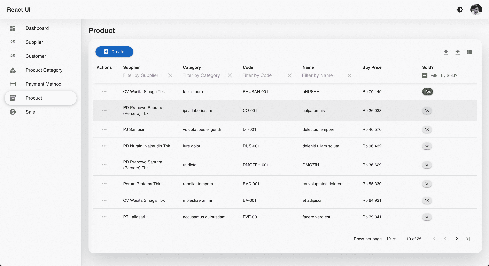

### ReactJS CRUD Generator

Standard CRUD Generator ReactJS with validation.

### Supported Features

#### Fields

- Checkbox
- Date
- Repeatable
- Select
- Text

#### Columns

- Text
- Tooltip button

#### Filters

- Date

#### Menu based Permissions

- [menu permissions](https://github.com/starmoozie/react-crud-generator/blob/main/src/constants/menu.js)

#### Packages

- Templating component [MUI](https://mui.com/)
- Field validation [React Hook Form](https://react-hook-form.com/), [Yup](https://github.com/jquense/yup)
- State management [Redux](https://redux.js.org/)
- Datatable [Material React Table](https://www.material-react-table.com/)
